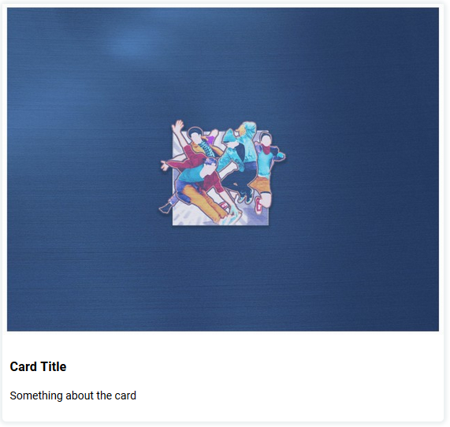

# Card Web Component

Create cards in your site without a sweat



```html
<card-element title="Card Title" image="./images/dance.jpg">
  <p>Something about the card</p>
</card-element>
```

## License

MIT © [Ameer Jhan](mailto:ameerjhanprof@gmail.com)
